<!-- Copyright (c) 2026 Luis Manuel Cousido Hermida. All rights reserved. -->

# Aprendizaje continuo del decisor: auditoría y plan de implementación

Fecha: 5 de octubre de 2026. HYDRA-SO permanece privado; Hyd es público.
Actualización de implementación: la fábrica local, rondas, revisión, afinamiento
opcional, persistencia SQLite y comparación preparada están descritos en
[DECISOR_CONTINUO_IMPLEMENTACION_2026-10-05.md](DECISOR_CONTINUO_IMPLEMENTACION_2026-10-05.md).
La auditoría inicial y su plan se conservan abajo como antecedentes. Supabase ya
tiene conexión de solo lectura verificada mediante Session pooler; no se aplicó SQL.
Rama revisada: `claude/blissful-davinci-7wtzs7`, commit
`73e0677f23bc33e46a5f169d7541e32036182fd7`.
Este documento propone trabajo: no activa un proceso periódico, no promociona
modelos y no convierte sugerencias de IA en etiquetas humanas.

## 1. Qué existe y qué demuestra

El módulo `hydra/training/decision_active_learning.py` implementa aprendizaje
activo con cuatro heurísticas de adquisición, una cola y una exportación de
filas revisadas. No es todavía un sistema completo que aprenda continuamente
ni una demostración de metaaprendizaje general.

Se ejecutaron los seis tests de aprendizaje activo/corpus v4: **6 passed**.
Ruff sobre el módulo y sus tests: **sin errores**. Se comprobaron los cinco
hashes de entrada contra la evidencia de la simulación: todos coinciden.
Las pruebas existentes cubren el camino básico; no prueban las garantías que
faltan abajo. Se repitió la simulación completa: conserva safety_margin como
selección y reproduce las cuatro cifras de test guardadas. La media de selección
de safety_margin redondea a 0,6312 en esta ejecución frente a 0,6313 en la evidencia
original; diferencia de 0,0001 en el valor informado, no una mejora nueva.

La evidencia versionada informa 480 ejemplos base, 300 del pool, 80 filas de
calibración y 80 de test, todos de procedencia sintética según el informe:

| Estrategia | Media de acierto durante rondas en selección | Test final informado |
|---|---:|---:|
| random, 3 ejecuciones | 59,84 % | 54,58 % |
| margin, 1 ejecución | 58,75 % | 60,00 % |
| entropy, 1 ejecución | 62,19 % | 60,00 % |
| safety_margin, 1 ejecución | 63,13 % | 61,25 % |

`calibration_auc` es la media de los aciertos después de las rondas, no un área
trapezoidal que incluya el punto inicial. Su denominación debe precisarse.
61,25 % equivale a **49/80** en un único test pequeño. La diferencia es una señal
para investigar, no evidencia de superioridad general ni de seguridad.
La variable de selección debe pasar a llamarse **dev de adquisición**: ya se
consulta repetidamente para elegir estrategias y no debe usarse también para
calibrar probabilidades o limiares.

La simulación no elige con el test, lo cual es correcto. Sin embargo, enseñar
los resultados de todas las estrategias en ese test tras cada ronda permite
ajustarse indirectamente a él. El test v4, ya observado, queda como regresión.
Se necesita otro conjunto humano reservado para una promoción independiente.
La reutilización adaptativa de holdouts requiere cuidados adicionales:
[Dwork y colaboradores, 2015](https://arxiv.org/abs/1506.02629).

No comparar el 61,25 % del test sintético de 80 filas con el 58,68 % del
experimento humano LOPO de Hyd sobre 5.844: cambian datos, particiones y modelos.

## 2. Hallazgos comprobados antes de automatizar

| Prioridad | Hallazgo | Corrección y prueba de cierre |
|---|---|---|
| P0 | `simulate` solo bloquea test exacto contra base/pool; admite calibración que repite entrenamiento. | Comprobar fit/dev/cal/threshold/test entre sí y frente al pool: IDs, texto, escenarios/familias y duplicados cercanos revisados. Test negativo para cada cruce. |
| P0 | `admit` acepta el texto editado de `queue.jsonl`; no verifica membresía/hash de la pregunta original ni vuelve a comprobar privacidad. | Cola original inmutable + archivo de eventos de revisión separado; verificar ID/hash y escanear el contenido admitido. Texto modificado exige nueva versión/revisión. |
| P0 | Un nombre escrito en `reviewer` basta; faltan evento de revisión, consentimiento/procedencia, fecha y vínculo al hash. | Registrar identidad local o autenticada, declaración humana y evento fechado ligado al contenido. No inventar verificación externa. El importador local de desarrollo seguirá siendo posible, con su nivel de evidencia explícito. |
| P1 | `select(k=0)` devuelve ejemplos; no hay límite válido de k en `make_queue`. | Rechazar k≤0, tipos incorrectos y presupuestos fuera del límite. Probar pool vacío, una sola clase y archivos inválidos. |
| P1 | `labels_budget=rounds*batch` puede superar lo adquirido. Prueba pequeña: declara 20 con solo dos filas disponibles. | Contadores por ronda de solicitado/seleccionado/revisado/admitido; detener al agotarse el pool. Curvas por etiquetas efectivas y minutos humanos. |
| P1 | La similitud se comprueba solo dentro de cada lote seleccionado. No protege familias entre rondas ni respecto al test. | Registro global de escenarios, reservas y revisiones; conservar variantes útiles, agruparlas y limitar repetición en la cola sin borrarlas del original. |
| P1 | `queue` vuelve a entrenar `TextClassifier`; no carga el decisor vigente ni usa `LlamaCppEncoder`. | Adaptador explícito que cargue un artefacto/revisión fijados para scoring, con encoder y extractor versionados. |
| P1 | `admit` exporta JSONL; no entrena un candidato. La CLI de `train_decision_v4` usa fuentes fijas y ruta por defecto en models/. | Comando de candidato con fuentes explícitas, salida nueva fuera del modelo activo, manifiesto y evaluación separada. No usar el comando por defecto como ciclo automatizado. |
| P1 | `--strategy-from` lee el archivo indicado; no busca automáticamente el último informe ni valida su vigencia/modelo/datos. | Selección versionada vinculada a hashes y protocolo; resolver solo evidencias compatibles y completas. |
| P1 | El gate de privacidad detecta patrones; no garantiza que no haya información personal. | Describirlo como detección, preservar cuarentena privada y revisión; no afirmar que todo texto restante está anonimizado. |

Se reprodujo la admisión de texto modificado con un correo **artificial** de
prueba. No se usaron datos personales reales ni se entrenó con esa fila.
Las pruebas de auditoría y resultados quedan en
`D:/HYDRA/.codex-artifacts/active-learning-audit-20261005/`.

Otros límites: safety_margin solo prioriza high_risk_review/security, sin
privacy/abstain; su masa 0,15 es heurística sobre probabilidades no calibradas,
no probabilidad verificada de daño. entropy mide incertidumbre de una fila,
no diversidad semántica del lote. Los empates usan etiquetas ya adquiridas,
pero el vocabulario de clases debe provenir de un contrato fijo, no de etiquetas
futuras del pool. Los IDs de cola usan solo 12 caracteres de SHA: usar digest
completo y comprobar colisiones.

En v4 `family` es el nombre de la clase; no sirve como agrupación de escenarios
para particionar todo el corpus. `template_id` sí agrupa variantes de cada
plantilla. El contrato nuevo debe separar `label` de `scenario_id/group_id`.

## 3. Ciclo propuesto

```mermaid
flowchart LR
  A[Importación consentida y fuentes identificadas] --> B[Validación y cuarentena privada]
  B --> C[Reserva previa por escenario y persona]
  C --> D[Selección activa y muestreo aleatorio]
  D --> E[Revisión humana exportable]
  E --> F[Admisión ligada al contenido]
  F --> G[Snapshot de entrenamiento]
  G --> H[Candidato aislado]
  H --> I[Dev y calibraciones separadas]
  I --> J[Pruebas de regresión y prueba humana reservada]
  J --> K[Informe y decisión humana]
  K --> L[Shadow y despliegue autorizado]
  L --> M[Monitor de errores y deriva]
  M --> A
  N[Generador de pruebas] --> B
```



Automatizar importación, validaciones, reservas, preparación de colas,
entrenamiento, evaluación e informes. Las personas confirman etiquetas,
resuelven ambigüedades y autorizan promoción. Ninguna ronda vacía o sin revisión
humana produce una mejora ficticia. Las operaciones peligrosas siguen protegidas
por las reglas del motor aunque el clasificador se equivoque.

## 4. Datos y revisión que sobrevivan a Lovable

Almacenamiento local de la fábrica como autoridad; Lovable puede ser una interfaz
mediante import/export. Toda fila, revisión y manifiesto debe exportarse como
JSON/JSONL; adjuntos con hashes y archivos accesibles. No guardar lo necesario
únicamente en una tabla o función de un proveedor.

Registro mínimo propuesto:

```json
{
  "id": "uuid",
  "text_sha256": "digest_completo",
  "source_kind": "human|synthetic|imported",
  "source_id": "id_del_origen",
  "group_id": "escenario_independiente",
  "person_id": "seudonimo_local",
  "rights_declaration": "referencia_a_declaracion",
  "consent_event_id": "referencia_a_evento",
  "split": "pool|fit|dev|cal_prob|cal_policy|reserved_test",
  "privacy_status": "pending|flagged|reviewed",
  "training_allowed": false
}
```

Texto original en almacén privado; versión redactada, si existe, ligada al
original sin sobrescribirlo. No inferir que toda pregunta con números es mala
ni que todas las variantes son independientes. Las preguntas propias sirven
para aprender y desarrollar; el test también debe medir otras personas y casos.

La revisión genera un evento append-only con ID, hash de contenido, etiqueta,
revisor/identidad disponible, fecha, origen humano y versión del contrato.
Permitir ambiguous/discard y dos tipos E3 independientes: peligro y falta de
contexto, con negativos explícitos. No completar una etiqueta automáticamente
si la persona cierra la página o acepta solo las sugerencias visualmente.

Primero mostrar la pregunta sin predicción; después de una primera decisión,
ofrecer las pistas bajo demanda. Una parte de riesgo/conflictos tendrá doble
revisión. Registrar discrepancias, no considerar acuerdo con el modelo como
prueba de calidad. Reusar componentes de `hydra/api/evaluation_routes.py` y
`evaluation_review.html`, con endpoint de revisión de **rutas** separado del
actual de evaluación de respuestas.

Exportar solo agregados al repo público Hyd. Datos, identidades, colas reales y
pesos candidatos privados no entran en Actions públicas. El job de aprendizaje
se ejecuta localmente/en nodo privado; CI público ejecuta pruebas artificiales
del código sin acceso a solicitudes reales.

## 5. Generación continua de pruebas nuevas

Tres conjuntos, informados por separado:

1. **Pruebas de software automáticas.** Esquemas, hashes, escrituras atómicas,
   exclusión de particiones, presupuesto, reanudación, fallos de encoder,
   import/export y rollback. Su resultado acredita el código, no la accuracy.
2. **Pruebas sintéticas de desafío.** Generación por escenarios y transformaciones
   controladas: registro coloquial, gallego/castellano, faltas, contexto ausente,
   adjuntos/capacidades, instrucciones contradictorias y rutas cercanas. Guardar
   generador/modelo/revisión/semilla/prompt y marcar siempre `source_kind=synthetic`.
3. **Pruebas humanas independientes.** Muestreo de preguntas nuevas consentidas,
   reservado antes de mirar las predicciones o puntuar adquisición. Etiqueta
   humana sin ver las sugerencias; custodio/evaluador distinto del ajuste cuando
   sea posible. Este conjunto fundamenta la promoción, no el sintético por sí solo.

Un generador de IA puede proponer casos y etiquetas, pero estas quedan pendientes.
Oráculos deterministas solo para condiciones comprobables; por ejemplo, que un
registro inválido se rechace o que una operación simulada no llegue al backend.
La ruta semántica esperada necesita contrato/revisión. No ejecutar comandos
destructivos de una pregunta para comprobarla.

Transformaciones que realmente preservan la ruta forman pruebas metamórficas.
Cambiar un número puede cambiar el riesgo, y añadir una imagen puede cambiar
vision/abstain: no conservar automáticamente una etiqueta en esas transformaciones.
Guardar parentesco por escenario, comprobar contradicciones y revisar la nueva
expectativa. El mismo escenario y sus paráfrasis nunca cruzan fit/test.

No generar a partir de respuestas o textos del test reservado. El generador de
entrenamiento no accede a ese almacén. Las pruebas nuevas son versiones
inmutables; si se expone un caso para depurarlo, pasa a regresión y se reserva
otro escenario nuevo. No sustituir preguntas difíciles para elevar el porcentaje.

Propuesta de arranque, todavía sin datos adquiridos: lotes de 40 revisiones y
20–40 desafíos sintéticos por ronda; construir gradualmente un test humano de
500 casos nuevos con cobertura de las diez rutas. Ese tamaño es un objetivo de
captura, no una garantía estadística ni independencia automática entre familias.
Muestreo representativo para accuracy global y un conjunto crítico deliberado
para recall de riesgo; no mezclar sus pesos sin informar cómo se adquirieron.

## 6. Selección, encoder y aprendizaje real

Reservar primero evaluación; seleccionar después desde el pool autorizado.
Probar una mezcla inicial de adquisición incierta, riesgo/diversidad y muestreo
aleatorio, por ejemplo 50/25/25. Son parámetros propuestos a validar en dev;
no son la estrategia ganadora demostrada. El componente aleatorio evita que
solo se vean los errores que el propio modelo sabe detectar.

Comparar estrategias al mismo presupuesto **efectivo** de revisiones y tiempo
humano. Variar semillas de orden/entrenamiento donde tenga efecto y usar
remuestreo por escenarios/personas, no solo cambiar el aleatorio de selección.
Conservar un challenger aleatorio y la estrategia vigente; no cambiarla tras
cada pequeña oscilación en 80 filas. Informar incertidumbre y abstenerse de
declarar un ganador si la evidencia es insuficiente. Las estrategias activas
pueden comportarse de forma distinta según datos/coste de anotación:
[Settles, revisión de aprendizaje activo](https://burrsettles.com/pub/settles.activelearning.pdf).

Conectar una interfaz `predict_proba` y un entrenamiento por backend explícito:
baseline léxica; MiniLM ya disponible localmente; encoder GGUF local mediante
`LlamaCppEncoder`; HYDRA Base si hay pesos verificables. Congelar y registrar
encoder/tokenizador/pesos/preprocesado/clases. El encoder no se conecta solo
pasándolo al módulo actual: necesita el adaptador y una cabeza compatible.
Validar endpoint local, dimensiones, NaN, timeout, caché ligada a los hashes y
paridad al recargar. No descargar otro modelo si el existente basta para comparar.

Inicialmente reentrenar una cabeza sobre snapshot acumulado y un conjunto de
replay de rondas previas; no actualizar pesos en servicio con cada clic. Después
comparar afinamiento supervisado del encoder si mejora dev y no olvida rutas.
No prometer que los embeddings elevarán la puntuación: medirlo sobre el mismo
protocolo. Calibración positiva escalar cambia confianza, no el argmax global.

## 7. Orquestador y recursos

Implementar un controlador de rondas de la fábrica, no otra autoridad de
promoción paralela. Integrar `hydra/training/lab.py`, `hydra/lab/lab.py` y el
registro de despliegue mediante un contrato único para este decisor; revisar
sus gates antes de utilizarlos, no adoptar un umbral genérico de calidad de LM.

Estados persistidos:
`COLLECTING → VALIDATED → WAITING_REVIEW → ADMITTED → SNAPSHOT_READY → TRAINING
→ EVALUATED → WAITING_APPROVAL → SHADOW → PROMOTED/REJECTED`, además de
`BLOCKED/FAILED/CANCELLED`. Esperar revisión es un estado normal, no un error.
Estos nombres son estados del futuro controlador, no del sistema de tareas Codex.

Eventos: importación nueva, review_saved, ronda completada, candidato finalizado
y drift_alert. Un temporizador puede comprobar pendientes; no dispara entrenamiento
sin datos nuevos. `round_id` y digest de snapshot como clave de idempotencia;
lock/lease, un único entrenamiento a la vez, heartbeat y reanudación después
de reinicio. Checkpoints incluyen fase, hashes de código/datos/modelo/config y
archivos completos: un hash distinto obliga a nueva ronda o a revisión explícita.

Perfil inicial propuesto: cola de 40, entrenamiento tras 40 etiquetas nuevas
aprobadas con diversidad comprobada, máximo dos candidatos por día, presupuesto
de GPU y disco explícito y pausa cuando faltan revisores. Medir el coste real
antes de fijar horas/minutos. CPU para baseline; RTX 3060 Ti de 8 GB para
MiniLM cuando esté disponible, sin competir con preentrenamiento HYDRA.
Recursos/colas limitados y cancelación dejan el modelo activo intacto.

Propuesta de layout privado, compatible con exportación:

```text
learning/decisor/
  sources/ quarantine/ registry/
  rounds/<round_id>/queue.jsonl reviews.jsonl manifest.json
  snapshots/<sha>/fit.jsonl dev.jsonl cal_prob.jsonl cal_policy.jsonl
  tests/regression/<version>/ challenge/<version>/ reserved/<version>/
  candidates/<candidate_id>/model/ calibration/ metrics/ manifest.json
  events.jsonl
```

## 8. Evaluación y promoción

En cada candidato: accuracy/macro-F1 por clase/persona/origen, confusiones,
recall de riesgo, precisión/FPR cuando existan negativos, NLL/Brier/ECE,
error selectivo/cobertura, memoria/latencia y recarga. Cada cifra ligada a
hashes y al conjunto concreto; separar sintético, humano, desafíos y regresión.
Variantes se conservan pero los intervalos y métricas adicionales por familia
evitan contarlas como pruebas independientes. Evaluar solo casos revisados y
mostrar también cuántos quedan pendientes, ambiguos o descartados.

Selección de modelo en dev, temperatura en cal_prob, limiares en cal_policy;
test reservado no participa en ninguna selección. El test independiente se
abre en hitos fijados previamente, no en cada intento. Una vez sus errores
orientan nuevas decisiones, queda como regresión. Hay que renovar escenarios
y declarar la exposición, no repetir indefinidamente hasta superar el 90 %.

Objetivo a acordar antes del primer candidato: ≥90 % global y macro-F1, recall
de riesgo ≥95 % y una política selectiva con cobertura útil. Son metas, no
resultados actuales. Informar intervalos y no permitir que una mejora global
oculte una degradación crítica. La revisión humana puede rechazar un candidato
aunque cumpla una media. Promoción requiere artefacto exacto, aprobación
versionada, shadow, rollback probado y límites operativos; nada se autopromociona.

Monitorizar cambios de idioma/clases/confianza y errores humanos confirmados.
Una deriva estadística abre una investigación/cola; no prueba automáticamente
que haya una etiqueta equivocada o que deba cambiar el modelo.

## 9. Implementación por entregas y pruebas de aceptación

| Etapa | Entregable | Cierre comprobable |
|---|---|---|
| P0 | Contrato de splits, registro de escenarios, admisión íntegra, presupuestos efectivos y entradas validadas | Los cuatro fallos reproducidos dejan de pasar; tests de cruces, manipulación, PII, doble admisión, k inválido y pool agotado. |
| P1 | Revisión humana local/exportable, eventos y manifiestos | Export→import sin pérdida; revisión ligada al hash; ambigüedad no autoetiquetada; dos revisores sin sobrescribir eventos. |
| P2 | Entrenador de candidatos + adaptador semántico | Mismas preguntas/particiones para baselines; pesos aislados; fallo de encoder no hace fallback silencioso; recarga equivalente. |
| P3 | Generador de pruebas y custodio del holdout | Semillas/revisiones trazables, origen sintético explícito, negativos/contexto, oráculos limitados y cero escenarios conocidos cruzados. |
| P4 | Controlador por eventos | Reinicio y ejecución duplicada no repiten admission/train; crash no altera active; límites de recursos y ausencia de datos detienen la ronda. |
| P5 | Calibración/evaluación separadas y gates | Selección nunca lee reserved_test; evidencia de modelo/dataset exactos; bloquea métricas sin soporte y calibrador ajeno. |
| P6 | Piloto humano, shadow y operación continua | Una ronda real completa auditada; informe antes/después emparejado; aprobación humana y rollback reproducible. |

Primera implementación recomendada: **P0 antes del temporizador**, después P1/P2.
No hay que esperar a tener un LM de 4B/7B para probar el decisor semántico.
El piloto puede comenzar con personas y herramientas ya disponibles; el coste
principal pendiente es revisión/independencia de datos, no vender ni constituir
una empresa.

## 10. Alcance de esta revisión

Leídos el módulo, sus tests, evidencia de simulación, generador/informe v4,
clasificador, entrenador, encoder local, gate de privacidad y componentes de
revisión/promoción relacionados. No se auditó línea por línea todo HYDRA ni
se verificó tráfico de producción, firmas de personas o servicios externos.
No se fusionó la rama revisada, no se ejecutó entrenamiento por defecto sobre
models/ y no se instaló un scheduler. El presente entregable es el plan y la
evidencia de auditoría; las etapas pendientes no se presentan como implementadas.

## 11. Rondas repetidas y afinamiento progresivo

Ampliación solicitada por el usuario: trabajar por pasos, repetir las rondas
y afinar según lo medido. Las épocas de entrenamiento repiten datos en los pesos;
las rondas incorporan evidencia nueva/revisiones. Repetir una misma evaluación
mil veces no proporciona mil pruebas independientes ni garantiza aprender.

Progresión propuesta:

1. Baseline léxica y semántica con encoder congelado, mismos casos y particiones.
2. Rondas humanas: incorporar nuevos escenarios y conservar replay de lo aprendido.
3. Ajustar cabeza, regularización, muestreo por familias y mezcla de representaciones
   solo con el dev interno; una modificación comprobable por experimento.
4. Si sigue limitado, afinar gradualmente las últimas capas del encoder y comparar
   con el control congelado. El preentrenamiento continuado de HYDRA Base es
   otro experimento y necesita su propio corpus/tokenizador y evaluación.
5. Recalibrar cada candidato seleccionado y evaluar regresiones/olvido antes de
   abrir el test humano de un hito y pedir aprobación de promoción.

Cada ronda conserva baseline, candidato, deltas por clase/persona, datos nuevos,
coste, semilla, configuración y una decisión de continuar/descartar/investigar.
Si varias rondas no mejoran dev, parar ajustes repetidos y revisar contexto,
diversidad o contrato de rutas. El controlador retiene el mejor candidato según
criterio fijado en dev, no el último por ser más reciente. No hay ajuste automático
de objetivos para dar por bueno un resultado peor.

## 12. Memoria cognitiva y persistente

Ya existe infraestructura en HYDRA: `WorkingMemory`, episodios/hechos/procedimientos,
`MemoryCompiler`, `MemoryRetriever`, `PostgresMemoryStore` y `FailureMemory`.
Se ejecutaron los tests de verificación de memoria y bootstrap online/calibrador:
**14 passed**. Esto no verifica una base PostgreSQL en producción ni demuestra
persistencia de la memoria de conocimiento sin ese backend.
No hace falta empezar otra memoria desconectada. La memoria de errores tiene
persistencia mediante DocumentStore; la memoria de conocimiento usa PostgreSQL
si está configurado y, en caso contrario, **InMemoryMemoryStore**, que no acredita
persistencia tras reinicio. No se ha comprobado aquí qué backend está activo
en un servicio de producción del usuario.

La memoria prevista tiene cuatro capas:

| Capa | Qué conserva | Uso |
|---|---|---|
| Trabajo | Objetivo, contexto real, dudas y resultados de una tarea | Se cierra con la tarea; no convertir todo en conocimiento permanente. |
| Episódica | Caso autorizado, decisión/predicción, revisión humana, resultado y artefactos | Recuperar experiencias y preparar nuevas rondas. |
| Semántica/procedimental | Hechos apoyados y procedimientos con evidencia, alcance y validez | Contexto y ayuda operativa; nunca sustituir permisos ni etiqueta humana. |
| Experimentos y errores | Qué versión falló/acertó, bajo qué condiciones y con qué coste | Evitar repetir fallos y decidir el siguiente experimento. |

El sistema recuerda evidencia; no tiene que presentar una interpretación generada
como verdad. Conservar estados unverified/supported/verified/conflict, fuentes y
revisiones. El retriever actual pondera estos estados, pero no excluye siempre
unverified/conflict: para decisiones o aprendizaje automático hacen falta filtros
de elegibilidad explícitos antes de buscar y antes de devolver resultados.

Primera entrega: backend persistente local compatible con MemoryStore, por ejemplo
SQLite para un nodo sin PostgreSQL, reutilizando mecanismos de escritura/reintento
del proyecto. PostgreSQL para nodos compartidos cuando esté disponible. Export
JSONL/manifiesto, backup/restore, migraciones versionadas y operación sin proveedor
externo. No activar una base ni copiar solicitudes hasta definir consentimiento
y ámbito de captura del piloto.

Agregar a recuerdos elegibles: contenido/hash, evento de origen, persona/tenant/
proyecto, permisos, consentimiento/retención, revisión, escenario, split, fecha,
versión del encoder, caducidad y conflictos. El esquema actual de MemoryItem
no impone todos estos campos. Aplicar permisos en la consulta, no después de
recuperar la memoria de otra persona. Un recuerdo revocado queda fuera de búsqueda,
colas, snapshots futuros y exportaciones; retirar su copia no desentrena por sí
solo pesos antiguos: registrar el alcance y evaluar reentrenamiento si corresponde.

No subir texto privado ni embeddings individuales al repositorio público. Tratar
la memoria recuperada como datos citables, no instrucciones capaces de cambiar
permisos. Redactar/aislar secretos y entradas sospechosas; no autoelevar confianza
porque el mismo modelo repita la misma afirmación.

### Recuperación para ayudar al decisor

Crear un índice de ejemplos humanos revisados **solo de fit/replay autorizados**,
con embeddings versionados y referencias completas. El test/dev/cal reservado
queda fuera del índice de entrenamiento/servicio experimental. El snapshot de
memoria se congela junto al candidato para que una evaluación sea reproducible.
Durante el test no se admiten sus preguntas ni respuestas como nuevos recuerdos.
El cache semántico también debe usar namespace/versiones y no saltarse estas reglas.

Comparación necesaria, en los mismos casos:

1. Clasificador sin recuperación.
2. Clasificador con los vecinos autorizados: similarity/top-k/mezcla elegidos en dev.
3. Clasificador afinado con replay, con y sin recuperación.

Registrar IDs/hashes de recuerdos usados y razón de abstención, con interfaz que
permita revisar el caso fuente. La similitud es una pista, no una garantía de la
misma ruta: números, contexto y permisos pueden cambiar la decisión. No atribuir
una mejora a pesos si solo procede de recuperar copias del caso evaluado.

Escala: `PostgresMemoryStore.all` limita por defecto a 5.000 recientes y la búsqueda
actual calcula similitud en Python; no es un índice de toda la historia. Medir
latencia/recall antes de sustituirlo por un índice vectorial; agregar filtros y
persistencia antes de optimizar. Cambiar encoder requiere reindexado versionado,
no mezclar vectores de modelos diferentes.

### Pruebas de cierre de memoria

- Guardar, cerrar proceso y recuperar desde un proceso nuevo con los mismos hashes.
- Backup/export/import reproducen registros elegibles, revisiones y relaciones.
- Separación persona/proyecto y bloqueo de unverified/conflict/revocados.
- El test y sus variantes conocidas nunca aparecen en recuperación ni caché.
- Cambio de encoder, dimensión o snapshot rechaza un índice incompatible.
- Dos escritores, caída durante commit y reanudación no duplican eventos.
- Correcciones humanas no sobrescriben el historial y no ejecutan instrucciones
  incrustadas en un recuerdo recuperado.
- Comparativa sin/con memoria: calidad por ruta, errores críticos, cobertura,
  latencia y qué parte de la ganancia depende de recuperación/replay.

Añadir una entrega M0 de persistencia y permisos junto a P1; M1 de índice revisado
después de P2; M2 de replay/consolidación tras medir P3–P5. Así la memoria ayuda al
ciclo desde el principio sin crear una fuente oculta de contaminación.

## 13. Hyd como sustituto medido de Kev dentro de HYDRA

La integración básica ya existe: `hydra/core/bootstrap.py` instala HydController
si `hyd_enabled` y usa las rutas de observación/autoridad del motor. El controlador
exige modelo/calibración/implementación ligados por hashes; su autoridad empieza
deshabilitada sin evidencia compatible. No hace falta crear otro motor de decisión.

Falta conectar el candidato semántico de los experimentos a ese contrato: los
NPZ de logistic regression no son automáticamente un artefacto cargable por
HydController. Convertir/exportar con formatos admitidos o introducir un adaptador
versionado y comprobar paridad, calibración y comportamiento de abstención.
El aprendizaje activo de la rama revisada pertenece a HYDRA-SO; el bucle común
debe consumir/producir contratos exportables para Hyd, evitando dos entrenadores
que creen pesos incompatibles para el mismo nombre de modelo.

Orden para sustituir a Kev:

1. Identificar y congelar la versión **real** de Kev: checkpoint, tokenizador,
   calibrador, instrucciones, backend y revisión; confirmar cuál está configurada
   en el runtime. No tomar como baseline una puntuación histórica de otro corpus.
2. Entrenar Hyd por rondas con el corpus humano admitido, encoder semántico,
   replay/memoria de fit y selección/calibración separadas. Conservar todos los
   textos/variantes útiles y el linaje de las revisiones.
3. Hacer una evaluación emparejada: Hyd y Kev reciben exactamente las mismas
   peticiones, contexto, adjuntos/capacidades y contrato de criterios, con el mismo
   presupuesto operativo. Si solo se compara task_type, declararlo: no acredita
   los demás criterios del decisor.
4. Evaluar global/macro-F1, rutas críticas, incertidumbre/cobertura, fallos, latencia
   y memoria. Intervalos y contraste emparejado agrupados por escenarios/personas;
   no basta que una media sea mayor. Mostrar errores discordantes para revisión.
5. Si Hyd supera a Kev sin degradar criterios críticos y cumple los gates fijados,
   exportar artefacto/calibración/evidencia y probar observación en HYDRA. No cambiar
   retrospectivamente métricas o preguntas para declarar victoria.
6. Aprobación humana, canary limitado con retorno a la versión previa y después
   sustitución. Conservar Kev como control/fallback mientras se comprueba estabilidad;
   el fallback tiene su propio contrato y nunca hereda autoridad por accidente.

El 58,68 % actual de Hyd es una baseline humana de desarrollo, no una victoria
frente a Kev. No existe aún en esta auditoría una comparación nueva, real y
emparejada entre los dos. Tampoco el 61,25 % sintético del otro clasificador lo
demuestra. El 90 % sigue como objetivo explícito, no condición suficiente para
operaciones críticas ni resultado garantizado por añadir memoria.

### PostgreSQL disponible en Supabase

La captura del usuario muestra el proyecto CeltIA Llms en eu-west-2 y 187/500 MB
de base de datos en ese momento. Sirve como opción para metadatos, rondas,
revisiones y recuerdos compactos; pesos, corpus masivo y ZIP permanecen en
almacenamiento de archivos con referencias/hashes. No se ha probado una conexión
ni se infiere que el proyecto esté vacío o dedicado exclusivamente a HYDRA.

HYDRA admite `HYDRA_POSTGRES_URL`. Para este servidor persistente, Supabase
documenta conexión directa cuando hay IPv6 o session pooler cuando se necesita
IPv4; usar TLS. Fuente oficial:
https://supabase.com/docs/guides/database/connecting-to-postgres

Preparación: obtener Connect del proyecto y guardar credenciales localmente como
secreto, fuera del repo/chat/logs; cuenta con permisos mínimos y esquema propio
o proyecto dedicado. Revisar tablas/datos existentes antes de aplicar SQL:
`hydra/persistence/postgres.py:create_pool` ejecuta actualmente `sql/schema.sql`
al iniciar. Una simple prueba de conexión debe usar un modo sin migraciones,
SELECT 1 e inventario de esquemas antes de activar ese bootstrap.

Probar después escritura/reinicio/lectura, aislamiento de personas, export/backup,
límites de conexiones y recuperación ante desconexión. No asumir persistencia
solo porque la página de Supabase abre. Mantener un modo local exportable para
que entrenamiento y revisión no dependan de disponibilidad del proveedor.
